# Sereus Cadre Architecture

This document describes the architecture of the Sereus Cadre system—the infrastructure that enables parties to control sets of nodes participating in distributed strand networks.

## Overview

A **cadre** is a party's personal cluster of nodes that collectively represent their presence across strands. Cadre nodes range from always-on cloud servers with terabytes of storage to intermittently-connected mobile devices. The cadre system provides:

- **Unified control**: A single control network through which a party manages all their nodes
- **Strand participation**: Automatic lifecycle management for joining, syncing, and leaving strand networks
- **Flexible deployment**: Support for self-hosted nodes, provider-hosted containers, and mobile devices
- **Key-based authorization**: Cryptographic authority delegation without central servers

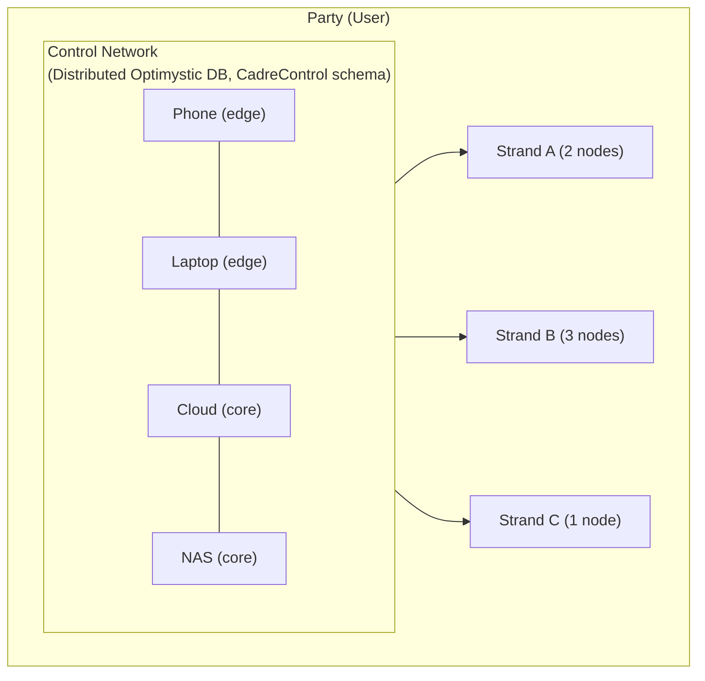

## Core Components

### Control Network

The control network is a private Optimystic network involving only the party's own cadre nodes. It uses the `CadreControl` schema to maintain:

| Table | Purpose |
|-------|---------|
| `AuthorityKey` | Keys authorized to make control changes |
| `ValidationKey` | Keys that can validate strand formation disclosures |
| `Strand` | List of strands the party participates in |
| `CadrePeer` | Registry of nodes in the cadre |
| `FormationInvite` | Open invitations to form strands with this party |
| `FormationUsage` | Audit log of formation invite consumption |

#### Network scoping (current implementation)

Cadre uses `@optimystic/db-p2p` to create libp2p+Optimystic nodes. In that implementation, **libp2p service protocols are namespaced by** `networkName` via:

- `protocolPrefix = /optimystic/${networkName}`
- control network uses `networkName = control-${partyId}`

Cadre-specific protocols are separate and live under `/sereus/*` (e.g. seed delivery uses `/sereus/seed/1.0.0`).

### Strand Networks

Each strand is an independent Optimystic network with its own:
- Network namespace: `networkName = strand-${strandId}` (libp2p services are scoped under `/optimystic/strand-${strandId}` in `@optimystic/db-p2p`)
- Member list (for closed strands)
- Application schema
- Peer cohort (union of all member cadres)

**Note:** the repository contains a proposed strand membership schema in `schemas/strand.qsql`, but the current `StrandDatabase` implementation applies only the sApp DDL under `declare schema App { ... }` (i.e. the `Strand` membership schema is not yet applied automatically).

### Cadre Node

A cadre node is a running instance of the `@serfab/cadre-core` library. Each node:

1. **Connects to the control network** using its PeerId and authorized bootstrap addresses
2. **Watches the `Strand` table** for changes (reactive pattern - which is a TODO for Optimystic so we'll have to poll for now)
3. **Starts/stops strand instances** as rows are added/removed
4. **Reports its multiaddr** back to `CadrePeer` for peer discovery

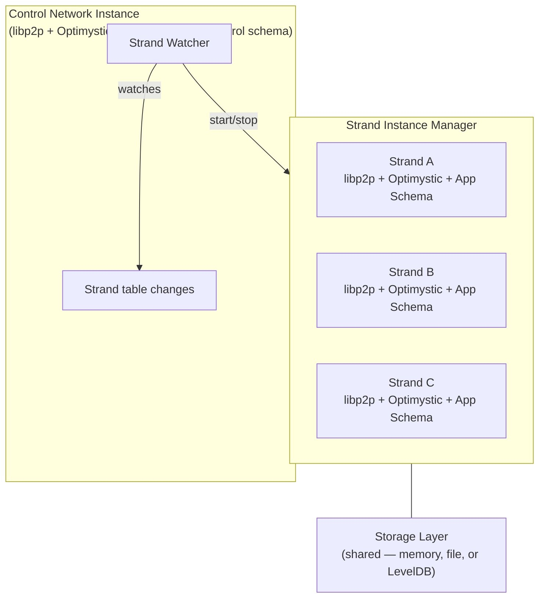

## Node Profiles

Cadre nodes operate in one of two profiles, distinguished by their storage role:

| Profile | Arachnode | Typical Deployment | Ring Participation |
|---------|-----------|--------------------|--------------------|
| **Transaction** | Disabled | Mobile devices, intermittent connectivity | Transaction verification via FRET only |
| **Storage** | Enabled (Ring Zulu + Storage Rings) | Servers, NAS, always-on nodes | Full block storage with capacity quotas |

Transaction-profile nodes skip Arachnode initialization entirely (no StorageMonitor, RingSelector, or RestorationCoordinator) for a lighter cold start. Storage-profile nodes initialize the full Arachnode subsystem including Ring Zulu and concentric storage rings.

### Strand Filtering

Mobile nodes typically run as part of a specific application and should not participate in all strands. The configuration includes an optional **strand filter**:

| Filter Mode | Behavior |
|-------------|----------|
| `all` | Participate in all strands in the control network (default for servers) |
| `sAppId:<id>` | Only participate in strands matching the specified sAppId |
| `strandId:<id>` | Only participate in a single specific strand |
| `none` | Control network only, no strand participation |

This allows a mobile app to embed a cadre node that only participates in the app's strand while the user's server nodes handle the full portfolio.

- **Ring Zulu (Transaction)**: Storage-profile nodes participate — transaction verification, ephemeral caching, forward to storage rings
- **Ring 3** (8 partitions) → **Ring 2** (4 partitions) → **Ring 1** (2 partitions) → **Ring 0** (full keyspace): Concentric storage rings. Storage-profile nodes join the appropriate ring based on capacity.

## Enrollment and Bootstrap

Adding a new node to a cadre involves a "cold start" problem: the new node needs control network data to validate connections, but can't get that data without first connecting. The **control network seed** solves this by pre-populating the new node's cache with enough authorization data to establish the first connection.

### The Cold Start Problem

When a new node joins a cadre:

1. **New node has empty control DB** — no `CadrePeer` entries, can't validate anyone
2. **Existing nodes enforce authorization in the DB layer** — CadreControl constraints reject unauthorized control writes; there is not yet a libp2p connection-gating layer
3. **NAT complicates dialing** — phones behind NAT can't receive incoming connections

The seed provides the minimal state needed to break this chicken-and-egg cycle.

### Control Network Seed

A seed contains everything a new node needs to join the control network:

```typescript
interface ControlNetworkSeed {
  // Identity - which control network to join
  partyId: string;

  // Authorization cache entries for peer validation
  peers: SeedPeer[];

  // Optional: signed Optimystic transactions for log consistency
  // (allows verification rather than blind trust)
  transactions?: SignedTransaction[];

  // Signature over { partyId, peers, transactions? }
  signature: string;

  // ed25519 public key (base64url) used to verify `signature`
  signerKey: string;
}

interface SeedPeer {
  peerId: string;           // libp2p peer ID
  multiaddrs: string[];     // Dial hints (may be empty if NAT'd)
  isAuthority: boolean;     // Hint: an authority-hosting peer to prefer dialing
  publicKey?: string;       // ed25519 public key (base64url) — present on authority peers for signerKey verification
}
```

The seed is **cache pre-population**, not a separate database. After applying the seed, the node's normal query mechanisms (`select * from CadrePeer`) fetch authoritative state from peers, naturally merging with the seed data.

### Unified Node Behavior

After applying a seed, a node follows a simple unified algorithm regardless of network topology:

1. Populate peerstore with peers + multiaddrs from seed
2. Attempt outbound dials (best effort) — prefer peers flagged `isAuthority` first
3. Once connected: begin control network sync (Optimystic), refresh via `select * from CadrePeer`
4. Periodic refresh (until reactivity): re-query CadrePeer, update local cache

The node doesn't need to know who will dial whom — it tries everything and accepts whatever works first.

### Enrollment Flow: Phone Adds Provider Drone

The most common case: a user on a NAT'd phone adds a provider-hosted node.

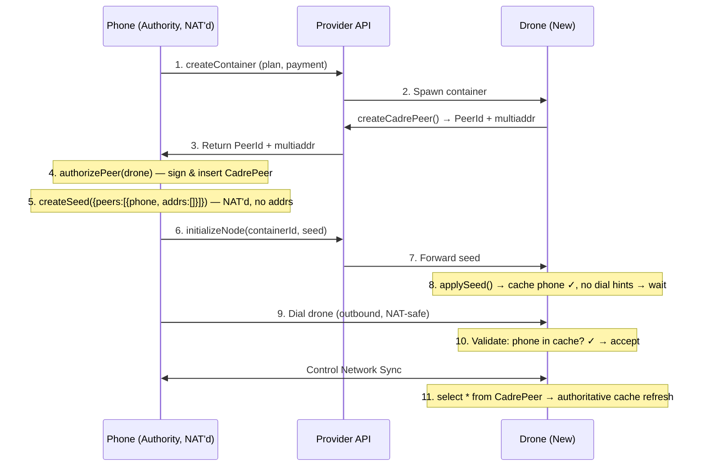

Key points:
- Phone is NAT'd → seed has no multiaddrs for phone → drone waits
- Phone dials drone (outbound from phone's perspective) → NAT-safe
- Drone validates phone against seed cache → connection accepted
- Normal sync populates authoritative state

### Enrollment Flow: Server Adds Phone

When a server (public IP) adds a phone to its cadre:

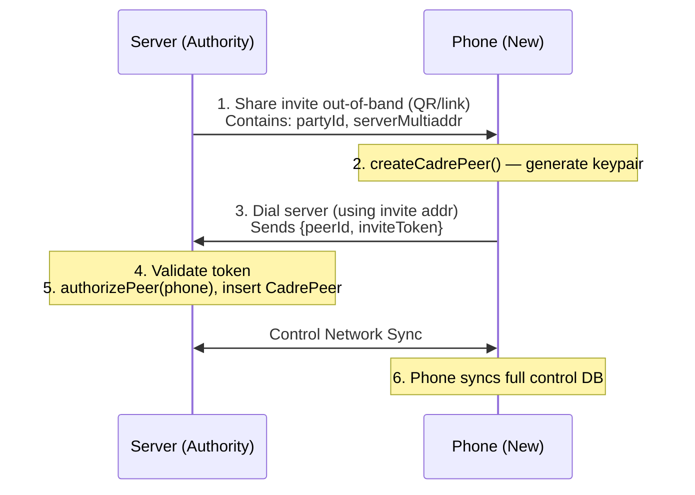

No seed needed — server is dialable, so phone just connects and syncs.

### Enrollment Flow: Server Adds Drone

When a server adds another provider-hosted node:

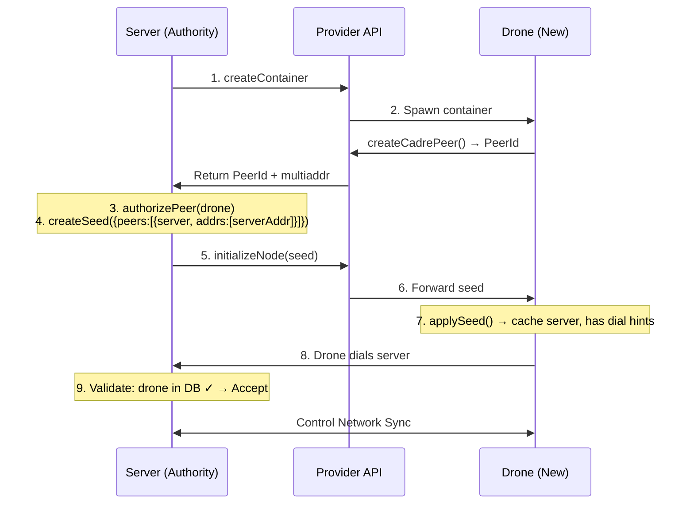

Seed includes `bootstrapAddrs` because server IS dialable. Drone initiates connection to server.

### When Is a Seed Needed?

| Instigator | Adding | Seed Needed? | Who Dials Whom? |
|------------|--------|--------------|-----------------|
| Phone (NAT) | Drone (public) | **Yes** — drone needs phone's CadrePeer in cache | Phone → Drone |
| Phone (NAT) | Phone (NAT) | **Yes** — both need each other; use relay addrs | Both → Relay |
| Server (public) | Phone (NAT) | **No** — phone can dial server directly | Phone → Server |
| Server (public) | Drone (public) | **Yes** — includes `multiaddrs` so drone can dial | Drone → Server |

The key asymmetry:
- **Instigator has public IP**: Seed includes `multiaddrs`, new node dials in
- **Instigator is NAT'd**: Seed has no `multiaddrs`, instigator dials out after seed is applied

### Seed Delivery Protocol

Seeds can be delivered through multiple mechanisms. For direct delivery when the new node is dialable, we define a libp2p protocol:

**Protocol ID**: `/sereus/seed/1.0.0`

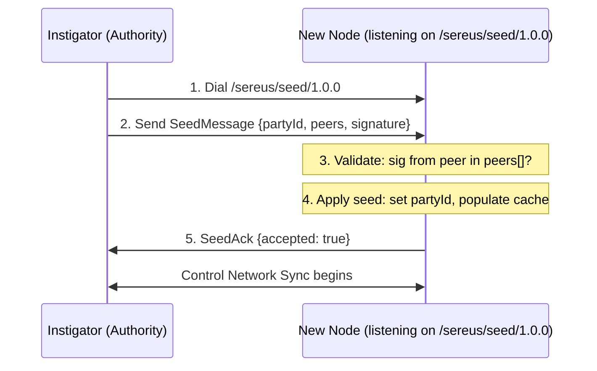

**Message Types**:

```typescript
// Instigator → New Node
interface SeedMessage {
  partyId: string;                    // Control network to join
  peers: SeedPeer[];                  // Authorization cache entries
  transactions?: SignedTransaction[]; // Optional: verifiable log entries
  signature: string;                  // Signed by an authority key
  signerKey: string;                  // Authority ed25519 public key (base64url)
}

// New Node → Instigator
interface SeedAckMessage {
  accepted: boolean;
  reason?: string;                    // Present if accepted=false
}
```

**Validation**:
- New node verifies `signature` using `signerKey` (ed25519)
- `signerKey` must match the `publicKey` of a peer with `isAuthority: true` in the seed's peer list — this ensures only actual authority holders can produce valid seeds
- TODO: enforce a trust policy for `signerKey` (e.g. pinned authority keys per party, or TOFU with explicit user confirmation)
- For additional security, seeds can include `transactions[]` with signed Optimystic entries

**Alternative Delivery Mechanisms**:

| Mechanism | When Used | Notes |
|-----------|-----------|-------|
| Direct protocol | New node is dialable | Instigator dials, sends seed directly |
| Provider API | Provider-hosted node | `POST /containers/:id/seed` via HTTPS |
| QR code / deep link | Mobile onboarding | Seed encoded in URL, opened by app |
| Environment variable | Container startup | `CADRE_SEED` contains base64-encoded seed |

All mechanisms deliver the same `SeedMessage` payload; only the transport differs.

### Simple API

From the **instigator's** perspective:

```typescript
// 1. Authorize the new peer
await cadreNode.authorizePeer(newNodePeerId, newNodeMultiaddrs);

// 2. Generate seed for the new peer
const seed = await cadreNode.createSeed();
// Includes: partyId, all authorized peers, our multiaddrs if dialable

// 3. Deliver seed (choose based on context)

// Option A: Direct protocol (if new node is dialable)
await cadreNode.deliverSeed(newNodeMultiaddr, seed);

// Option B: Via provider API
await provider.initializeNode(containerId, seed);

// Option C: Encode for out-of-band delivery
const encodedSeed = cadreNode.encodeSeed(seed);  // base64
// Share via QR, link, etc.

// 4. If we're NAT'd and new node can't dial us, we dial them
if (!weHavePublicIp) {
  await cadreNode.connectToPeer(newNodeMultiaddr);
}
```

From the **new node's** perspective:

```typescript
// 1. Receive seed (one of these, depending on delivery mechanism)

// Option A: Listen for direct delivery
cadreNode.on('seed', async (seed) => {
  await cadreNode.applySeed(seed);
});

// Option B: From environment (container startup)
const seed = process.env.CADRE_SEED
  ? decodeSeed(process.env.CADRE_SEED)
  : null;
if (seed) {
  await cadreNode.applySeed(seed);
}

// 2. Start node - automatic connection handling
await cadreNode.start();
// Node now:
// - Accepts connections from peers in cache
// - Dials any peers with known multiaddrs
// - Syncs once connected
```

### Helper Functions for Common Scenarios

The Seed Bootstrap API includes helper functions for common enrollment patterns:

**Server/Phone adds Drone (via provider API)**:
```typescript
// Authority receives drone info from provider API
const droneInfo = await provider.createContainer(plan);

// One call: authorize + create seed
const { seed, encodedSeed } = await cadreNode.addDrone({
  dronePeerId: droneInfo.peerId,
  droneMultiaddrs: droneInfo.multiaddrs
});

// Send seed to provider for drone initialization
await provider.initializeNode(droneInfo.containerId, encodedSeed);
```

**Server invites Phone (QR/link flow)**:
```typescript
// Server creates invite
const { invite, encodedInvite } = await serverNode.createInvite(
  'secret-token',  // Optional token
  3600000          // Expires in 1 hour
);
// Share encodedInvite via QR code or link

// Phone receives invite and dials
const invite = phoneNode.decodeInvite(encodedInvite);
await phoneNode.dialInvite(invite);
// Phone is now connected, sends join request with token

// Server accepts phone
await serverNode.acceptPhone(
  { phonePeerId: phonePeerId, token: 'secret-token' },
  invite
);
```

**Phone adds Phone (NAT-to-NAT via relay)**:
```typescript
// Authority phone adds new phone with relay support
const { seed, encodedSeed } = await authorityPhone.addPhoneWithRelay(newPhonePeerId);
// Seed includes relay addresses for the new phone to dial through

// Share encodedSeed out-of-band
// New phone applies seed and connects via relay
```

## Strand Lifecycle

### Reactive Strand Management

Cadre nodes watch the control network's `Strand` table for changes. When a strand is added, each node:

1. Creates a new libp2p node via `@optimystic/db-p2p` with `networkName = strand-${strandId}` (protocols scoped under `/optimystic/strand-${strandId}`)
2. Loads the strand's sApp schema via declarative schema
3. Bootstraps into the strand's cohort
4. Begins participating in transactions

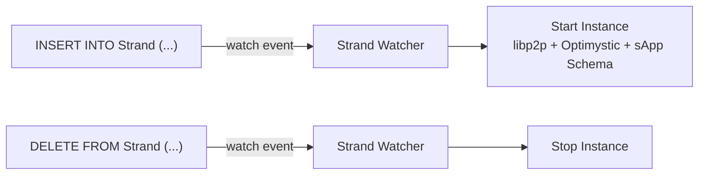

### Strand Mode: Bootstrap vs Networked

Each strand instance is started in one of two modes (`StrandMode`), which selects the default transactor wired into the optimystic plugin:

| Mode | Default Transactor | When Used |
|------|--------------------|-----------|
| `networked` (default) | `network` — issues transactions through the strand's libp2p cohort | Multi-peer participation; the normal strand lifecycle |
| `bootstrap` | `local` — executes transactions against host-local raw storage with no peer round trips | Solo-node startup (e.g. first-launch, single-device cadre) where the cohort isn't reachable yet but the strand still needs to apply schema and accept DML |

In `bootstrap` mode the same `IRawStorage` instance handed to `createLibp2pNode` is also passed to the optimystic plugin via `rawStorageFactory`, so DML executed through the local transactor lands on the host's persistent backend (e.g. file system on Node, MMKV on React Native) instead of an in-memory store. Sharing the single instance — rather than constructing a second `IRawStorage` over the same id/prefix — keeps the libp2p and database read paths consistent and avoids cache divergence. The mode is fixed for the lifetime of a `StrandDatabase`; transitioning requires restarting the strand.

### Strand Formation

When forming a new strand with another party, the bootstrap protocol (`strand-proto`) negotiates provisioning. The `StrandFormationManager` bridges `cadre-core` interfaces with `strand-proto`'s `SessionManager`:

- **`StrandFormationManager`**: Implements `SessionHooks` by delegating to `DisclosureValidator`, `FormationUsageRecorder`, and `StrandProvisioner`
- **`StrandSolicitationService.registerResponder(node)`**: Registers the libp2p node to handle incoming formation requests
- **`StrandSolicitationService.formStrand(invitation, disclosure, node)`**: Initiates strand formation over the real protocol
- **`CadreNode` high-level API**: `createOpenInvitation()`, `formStrand()`, `encodeInvitation()`, `decodeInvitation()`

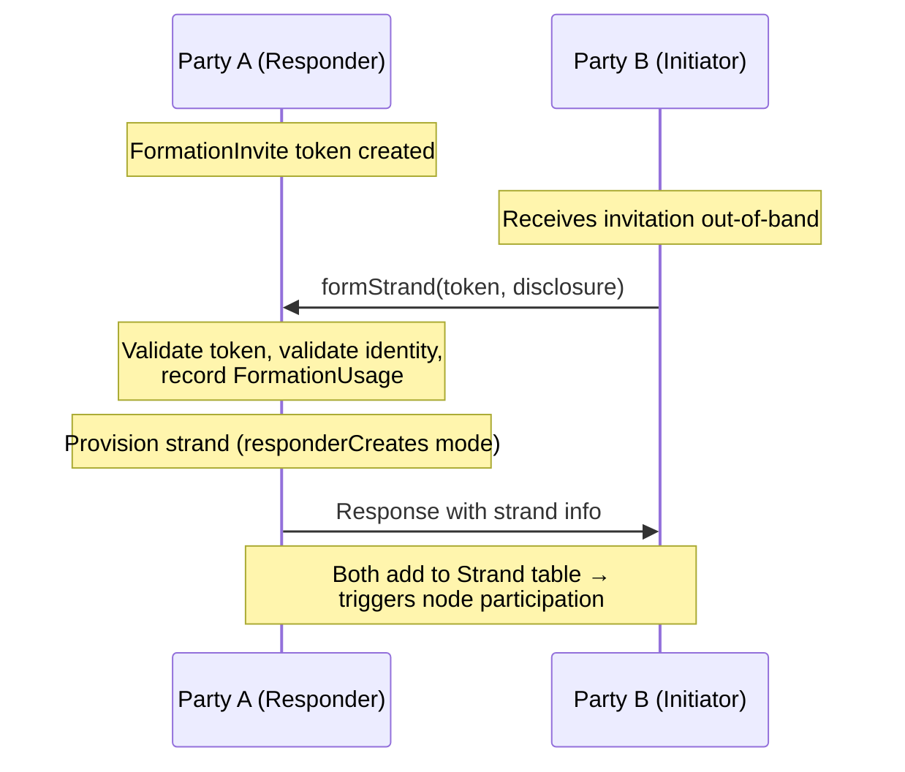

### Strand Hibernation

A party may participate in many strands (potentially hundreds), but most are inactive at any given time. Maintaining live libp2p connections for all strands wastes resources. The hibernation system manages strand instance lifecycle based on activity:

**Strand States:**

| State | Description | Connections |
|-------|-------------|-------------|
| `active` | Actively transacting, recent activity | Full libp2p node running |
| `idle` | No recent activity, monitoring for wake | Minimal or no connections |
| `hibernating` | Long-term inactive | No connections, wake via control network |

**Activity-Based Transitions:**

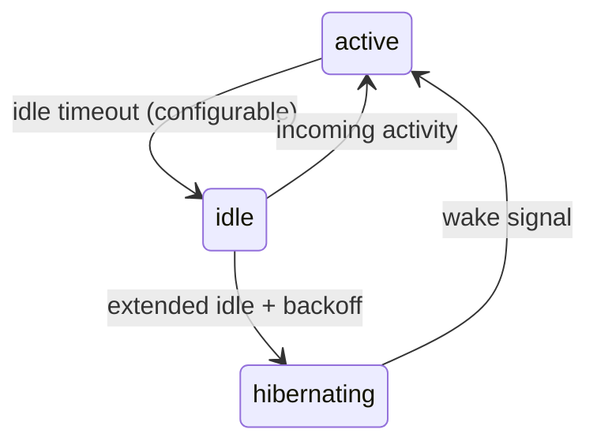

**Idle Strand Behavior:**
- Disconnect from strand peers but retain local state
- Periodic check-in with exponential backoff (minutes → hours → days)
- Check-in queries cohort for pending transactions

**Wake Mechanisms:**
1. **Local wake**: Application explicitly activates the strand
2. **Check-in wake**: Periodic check-in discovers pending activity
3. **Push wake**: Another cadre member (with incoming connectivity) receives wake request and propagates via control network

**sApp Latency Hints:**

Applications can provide latency hints in the strand header that influence hibernation behavior:

| Hint | Idle Timeout | Check-in Interval | Use Case |
|------|--------------|-------------------|----------|
| `realtime` | Never hibernate | N/A | Messaging, live collaboration |
| `interactive` | 5 minutes | 30 seconds | Active apps, transactions |
| `background` | 1 minute | 5 minutes | Social feeds, notifications |
| `archive` | 10 seconds | 1 hour | Rarely accessed data |

## Network Isolation

Each strand operates as a completely isolated libp2p network. This isolation is achieved through:

1. **Network name scoping**: Each strand uses `networkName = strand-${strandId}` which results in protocol prefix `/optimystic/strand-${strandId}` for libp2p services (identify, cluster, repo, sync) within `@optimystic/db-p2p`
2. **Separate libp2p node**: Each strand instance runs its own libp2p node with independent connection management
3. **Independent DHT**: Each strand's FRET overlay is scoped to its `networkName`
4. **Separate storage namespace**: Each strand's Optimystic data is partitioned by strand ID

- **Control Network** (`/optimystic/control-<party-id>`): peers = only this party's cadre nodes; data = CadreControl schema
- **Strand Network A** (`/optimystic/strand-<uuid-a>`): peers = Cohort A (Party 1, 2, 3); data = sApp A schema
- **Strand Network B** (`/optimystic/strand-<uuid-b>`): peers = Cohort B (Party 1, 4); data = sApp B schema
- ... and so on for each strand

No cross-network communication. Each network has its own connection pool, gossipsub mesh, FRET routing table, and cluster coordination.

## Provider Integration

Cloud providers can host cadre nodes on behalf of users. The provider never has access to user keys—nodes generate their own libp2p identity and are authorized via signed messages.

### Provider Flow

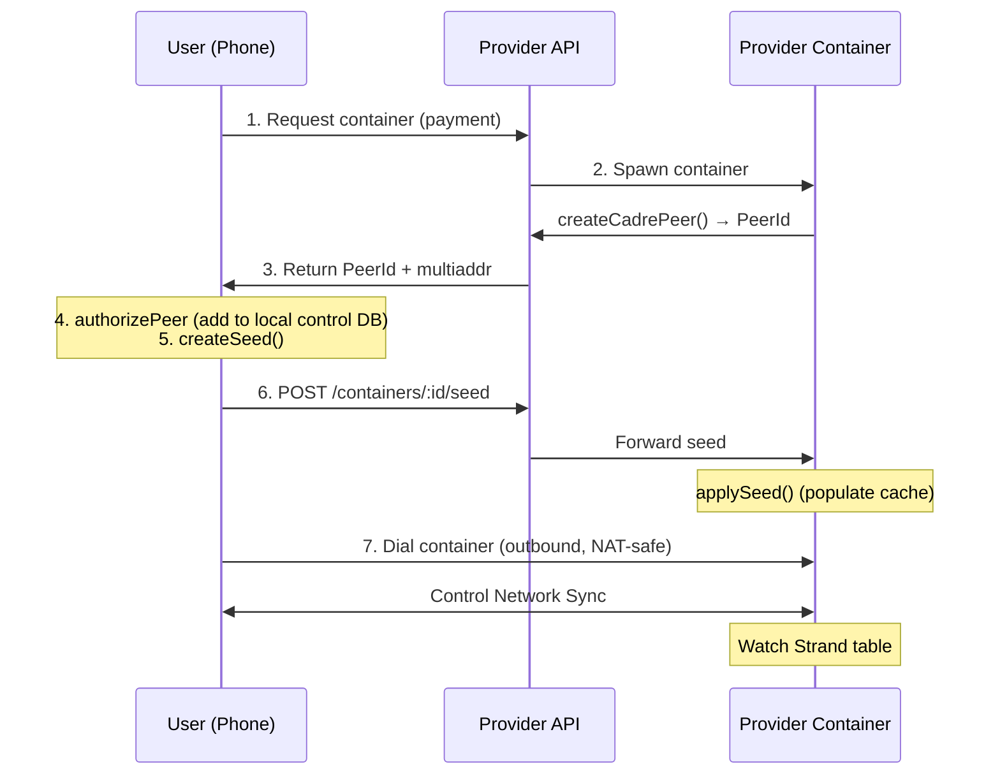

Provider only sees: container ID, network traffic, opaque seed. Provider never has: authority keys, strand data.

### Relay Integration

For NAT'd nodes to be reachable, they include circuit relay addresses in seeds:

```typescript
// Phone gets its relay-routed address
const relayAddr = await cadreNode.getRelayAddress();
// e.g., /dns4/relay.provider.com/tcp/4001/p2p/<relay>/p2p-circuit/p2p/<phone>

// Include in seed when adding another NAT'd node
const seed = await cadreNode.createSeed();
// seed.peers[0].multiaddrs = [relayAddr]
```

When both nodes are NAT'd (e.g., phone adding another phone), the seed includes relay addresses so the new node can dial through the relay:

```mermaid
sequenceDiagram
    participant P1 as Phone 1 (Authority)
    participant R as Relay
    participant P2 as Phone 2 (New)
    Note over P1: Seed includes relay addr:<br/>/dns4/.../p2p-circuit/p2p/&lt;phone1&gt;
    P1-->>R: Connected to relay
    P2->>R: Dial relay (from seed addr)
    R->>P1: Circuit relay connection
    P1<<->>P2: Control Network Sync
```

Once multiple nodes with public IPs exist in the cadre, the control network becomes more resilient and less dependent on relays.

## Deployment Configurations

### Minimal (Single Phone)

- **Phone** as sole cadre node: transaction-only profile, connectivity via relay when behind NAT, participates in all strands (limited by battery/connectivity)
- Limitations: no redundancy (phone offline = party unreachable), no archival storage, relay-dependent for inbound connectivity

### Standard (Phone + Cloud Node)

- **Phone** (transaction-only, has authority keys) ↔ **Cloud Node** (storage profile, always online, public IP, archival storage)
- Benefits: redundancy (either can serve control network), storage capacity for strand data, cloud node as bootstrap for new nodes/peers

### Enterprise (Multi-Node Mixed)

- **Phone + Laptop** (transaction-only) · **Cloud ×3** (storage/backup) · **On-prem NAS ×2** (primary storage)
- High availability (multiple always-on nodes), geo-distributed storage, key material secured on mobile, scales to many strands

## Package Structure

The cadre system is implemented across several packages:

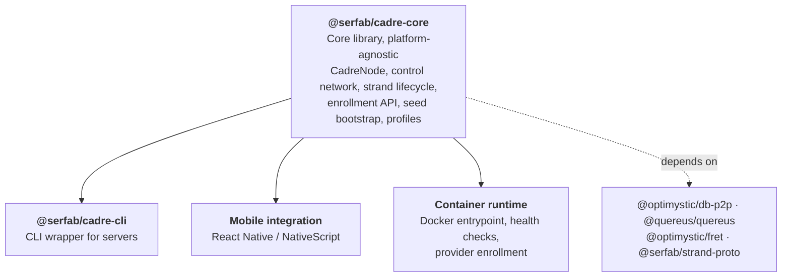

## Key Data Structures

### CadreNode Configuration

```typescript
interface CadreNodeConfig {
  // Node identity
  privateKey?: Uint8Array;        // If provided, use this keypair

  // Control network connection
  controlNetwork: {
    partyId: string;              // UUID of the party/control network
    bootstrapNodes: string[];     // Multiaddrs to join control network
  };

  // Node profile
  profile: 'transaction' | 'storage';

  // Strand filtering (which strands to participate in)
  strandFilter?:
    | { mode: 'all' }                           // All strands (default for servers)
    | { mode: 'sAppId'; sAppId: string }        // Only strands for specific app
    | { mode: 'strandId'; strandId: string }    // Single specific strand
    | { mode: 'none' };                         // Control network only

  // Storage configuration (only for storage profile)
  // Uses the provider pattern for cross-platform support (Node.js, React Native, etc.)
  storage?: {
    provider: IRawStorage | ((strandId: string) => IRawStorage);  // Storage instance or factory
    quotaBytes?: number;          // Maximum storage to use
  };

  // Network configuration
  network: {
    listenAddrs?: string[];       // Addresses to listen on
    announceAddrs?: string[];     // Addresses to advertise
    relayAddrs?: string[];        // Relay servers to connect through
    enableRelay?: boolean;        // Enable circuit relay (default: true for storage profile)
    transports?: Libp2pTransports; // Custom libp2p transports (default: TCP + relay)
  };

  // Hibernation configuration
  hibernation?: {
    enabled: boolean;             // Whether to hibernate idle strands
    defaultLatencyHint?: 'realtime' | 'interactive' | 'background' | 'archive';
  };
}
```

### Strand Instance State

```typescript
interface StrandInstance {
  strandId: string;
  status: 'starting' | 'active' | 'idle' | 'hibernating' | 'stopping' | 'stopped' | 'error';

  // App information (from strand header, verified by signature)
  sAppInfo: {
    Id: string;                // Public key of app author
    Version: string;
    Schema: string;            // The declarative schema DDL
    Signature: string;         // Author's signature over schema
  };

  // Runtime components (only when active/idle)
  libp2pNode?: Libp2p;
  database?: Database;

  // Membership info (for closed strands)
  memberKey?: string;
  memberPrivateKey?: string;

  // Activity tracking
  connectedPeers: number;
  lastActivity: Date;
  nextCheckIn?: Date;             // For idle/hibernating strands

  // Latency hint (from app or override)
  latencyHint: 'realtime' | 'interactive' | 'background' | 'archive';
}
```

### Cross-Platform Storage Setup

The storage provider pattern decouples cadre-core from any specific storage backend, enabling the same code to run on Node.js servers, React Native mobile apps, and in test environments.

#### Node.js (Servers, CLI)

```typescript
import { CadreNode } from '@serfab/cadre-core';
import { FileRawStorage } from '@optimystic/db-p2p-storage-fs';

const node = new CadreNode({
  // ...
  storage: {
    provider: (strandId) => new FileRawStorage(`/data/sereus/${strandId}`),
    quotaBytes: 10 * 1024 * 1024 * 1024  // 10 GB
  }
});
```

#### React Native (Mobile)

```typescript
import { CadreNode } from '@serfab/cadre-core';
import { RNRawStorage } from '@optimystic/db-p2p-storage-rn';
import { webSockets } from '@libp2p/websockets';
import { circuitRelayTransport } from '@libp2p/circuit-relay-v2';

const node = new CadreNode({
  // ...
  profile: 'transaction',
  strandFilter: { mode: 'sAppId', sAppId: 'com.example.myapp' },
  storage: {
    provider: (strandId) => new RNRawStorage(strandId)
  },
  network: {
    transports: [webSockets(), circuitRelayTransport()],
    listenAddrs: []  // RN nodes typically cannot listen
  }
});
```

#### In-Memory (Testing)

```typescript
import { CadreNode } from '@serfab/cadre-core';
import { MemoryRawStorage } from '@optimystic/db-p2p';

const node = new CadreNode({
  // ...
  storage: {
    provider: () => new MemoryRawStorage()
  }
});
```

#### Available Storage Implementations

| Package | Environment | Class | Description |
|---------|-------------|-------|-------------|
| `@optimystic/db-p2p` | All | `MemoryRawStorage` | In-memory, for testing only |
| `@optimystic/db-p2p-storage-fs` | Node.js | `FileRawStorage` | File system persistence |
| `@optimystic/db-p2p-storage-rn` | React Native | `RNRawStorage` | AsyncStorage-based persistence |

The `provider` field accepts either an `IRawStorage` instance (shared across all strands) or a factory function `(strandId: string) => IRawStorage` (recommended—creates isolated storage per strand). The factory pattern ensures each strand's data is partitioned, simplifying cleanup and preventing cross-strand interference.

### React Native Polyfills

React Native (Hermes engine) requires polyfills for several Web/Node.js APIs that libp2p, multiformats, and Optimystic depend on. These must be loaded before any library code in the app entry point. The full polyfill inventory — including global API shims (crypto, structuredClone, EventTarget via `event-target-polyfill`, Promise.withResolvers, etc.) and Metro module aliases for Node.js built-ins (os, crypto, stream, buffer, net/tls empty stubs) — is documented in:

- [Reference App: Polyfills](reference-app-rn.md#polyfills) — working implementations in `packages/reference-app-rn/polyfills/`
- [@optimystic/db-p2p README: React Native](https://github.com/gotchoices/optimystic/blob/master/packages/db-p2p/README.md#react-native) — polyfill checklist for any RN consumer of db-p2p

## References

### Internal Documentation

- [Arachnode Architecture](arachnode.md) - Storage ring system
- [Strand Management](strands.md) - Strand concepts and negotiation
- [Bootstrap Protocol](strand-proto.md) - Formation protocol details
- [API Specification](api.md) - Cadre peer authorization API

### Schemas

- `schemas/control.qsql` - CadreControl schema for control network
- `schemas/strand.qsql` - Strand schema for membership management

### Existing Implementations

- `@gotchoices/optimystic/packages/db-p2p` - libp2p node creation with Optimystic integration
- `packages/strand-proto` - Bootstrap session management
- `packages/cadre-core` - Core cadre node library
- `packages/cadre-cli` - CLI wrapper for cadre nodes
- `packages/cadre-provider` - Reference provider service for hosting cadre nodes
- `ops/docker/libp2p-infra` - Container infrastructure for relay/bootstrap nodes

---

## Implementation Status

### `@serfab/cadre-core` (Complete)

- **CadreNode**: Main entry point with `start()`/`stop()` lifecycle, event emission, control network management
- **StrandWatcher**: Poll-based monitoring of `Strand` table with configurable filters (`all`, `sAppId`, `strandId`, `none`)
- **StrandInstanceManager**: Per-strand libp2p node creation with isolated storage paths, sApp schema application, and ed25519 schema signature verification on strand start
- **Schema Verification**: `signSchema()`, `verifySchema()`, `assertSchemaSignature()` — ed25519 signature verification of sApp schemas gating strand join
- **EnrollmentService**: `createCadrePeer()` for Ed25519 keypair generation
- **Seed Bootstrap API**: `createSeed()`, `applySeed()`, `deliverSeed()`, `encodeSeed()`/`decodeSeed()`, helper functions (`addDrone`, `createInvite`, `acceptPhone`, `addPhoneWithRelay`)
- **Member Registration API**: `registerMember()`, `validateMemberRegistration()` with pluggable verifier/registry interfaces
- **Strand Solicitation API**: `createOpenInvitation()`, `formStrand()`, `validateStrandFormation()` with full `strand-proto` SessionManager integration via `StrandFormationManager`
- **Hibernation**: Activity-based lifecycle with latency hints (`realtime`, `interactive`, `background`, `archive`), configurable timeouts, exponential backoff check-in
- **Profile Configuration**: Transaction vs storage mode with FRET profile mapping

### `@serfab/cadre-cli` (Complete)

- CLI commands: `cadre start`, `cadre status`, `cadre enroll`, `cadre strands`
- YAML/JSON config with environment variable overrides
- Systemd service file with security hardening, graceful shutdown

### Container Runtime (Complete)

- Docker image based on node:22-alpine with entrypoint script
- Health check endpoints (`/health`, `/ready`, `/status`)
- Provider integration: enrollment token, status reporting, metrics, seed delivery
- Docker Compose template with volume and network configuration

### `@serfab/cadre-provider` (Complete)

- Provider API: container CRUD, billing plans/status, seed delivery, peer info
- Billing integration: usage metering, Stripe-ready hooks, quota enforcement
- Orchestration: Docker orchestrator, mock orchestrator, pluggable interface

### Testing (127 tests passing)

- Unit tests: CadreNode, StrandWatcher, StrandInstanceManager, EnrollmentService, StrandSolicitationService, SchemaVerification, types
- Integration tests: Seed bootstrap, strand formation protocol

